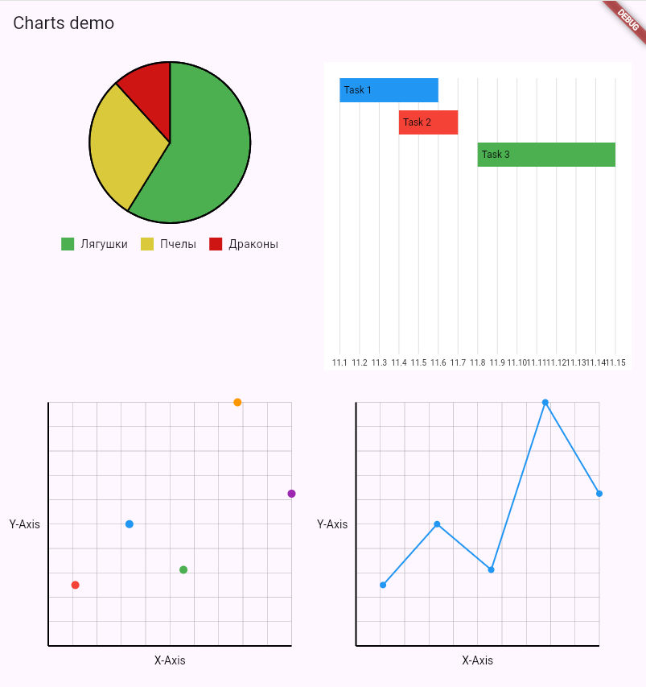

# Graphaello

[](https://opensource.org/licenses/MIT)

## 🎨 О Graphaello

**Graphaello** — это пакет виджетов, которые помогут Вам рисовать красивые и кастомизируемые графики. Основная причина его создания - отсутстуие хороших альтернатив среди Российского сегмента.


## 📦 Возможности

- **Круговые диаграммы**: Визуализация данных в виде частей целого.
- **Точечные графики**: Для отображения данных на плоскости с координатами.
- **Линейные графики**: Построение трендов с использованием линий.
- **Гистограммы**: Простое создание столбиковых диаграмм.
- **Сетка и оси**: Удобные оси и координатные сетки для навигации.
- **Подписи осей**: Добавление текста для X и Y осей.

## 🚀 Начало работы

1. Добавьте библиотеку в `pubspec.yaml`:

```yaml
dependencies:
  graphaello: ^1.0.0
```

Или Добавьте ссылку на репозиторий GitHub:
```yaml
dependencies:
  gant:
    git:
      url: https://github.com/JesterVZ/gant.git
```

2. Импортируйте библиотеку:

```dart
import 'package:gant/charts.dart';
```


## 📋 Примеры

### Круговая диаграмма:

```dart
PieChart(
  data: [
    PieData(name: 'Лягушки', value: 40, color: Colors.green),
    PieData(name: 'Пчелы', value: 30, color: Colors.yellow),
    PieData(name: 'Драконы', value: 30, color: Colors.red),
  ],
)
```

### Гистограмма (В разработке):

```dart
BarChart(
  data: [
    BarData(label: 'A', value: 20, color: Colors.red),
    BarData(label: 'B', value: 40, color: Colors.blue),
    BarData(label: 'C', value: 25, color: Colors.green),
  ],
  xLabel: 'Categories',
  yLabel: 'Values',
)
```

### Линейная диаграмма:

```dart
LineChart(
  data: [
    LineData(x: 1, y: 10),
    LineData(x: 2, y: 20),
    LineData(x: 3, y: 15),
    LineData(x: 4, y: 25),
  ],
  xLabel: 'Time',
  yLabel: 'Values',
)
```

### Точечный график:

```dart
ScatterPlot(
  data: [
    ScatterData(x: 10, y: 20, color: Colors.red),
    ScatterData(x: 30, y: 40, color: Colors.blue),
    ScatterData(x: 50, y: 25, color: Colors.green),
  ],
  xLabel: 'X-Axis',
  yLabel: 'Y-Axis',
)
```

## 📷 Демонстрация



На изображении представлены следующие графики:
- **Круговая диаграмма**
- **Гант-график**
- **Точечный график**
- **Линейный график**

## 🤝 Поддержка

Если у вас есть вопросы или вы хотите внести вклад в развитие Graphaello, создайте issue или откройте pull request в [репозитории](https://github.com/JesterVZ/gant.git).
